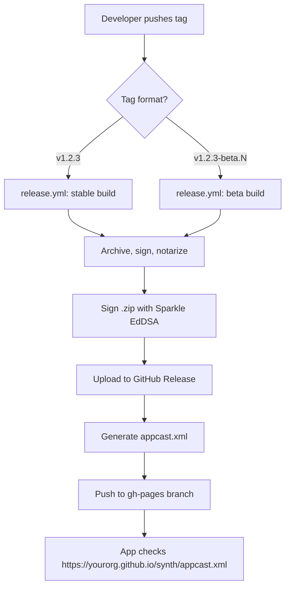

# Sparkle Auto-Updates via GitHub

## Problem Statement
Synth needs an auto-update mechanism so users get new versions without manual downloads. Updates should be served from GitHub infrastructure (Releases + Pages), with separate stable and beta channels, triggered by semver tags.

## Requirements
- Integrate Sparkle 2 via SPM for automatic background update checks on launch
- Version from git tags: `v1.2.3` for stable, `v1.2.3-beta.1` for beta
- Host appcast XML on a `gh-pages` branch, auto-regenerated by CI
- Two channels: default (stable) and `beta`
- Only the latest release per channel in the appcast
- One-time EdDSA key generation, stored as GitHub secrets
- "Check for Updates" menu item in the app
- Beta channel opt-in via a toggle in Settings

## Background
- The app is a SwiftUI macOS app (`com.synth.app`) built with Xcode, no existing SPM dependencies in the main target
- Existing `package.yml` workflow already handles code signing, notarization, and GitHub Release creation on push to `main`
- Sparkle 2 supports channels natively — items tagged `<sparkle:channel>beta</sparkle:channel>` are only visible to updaters that opt into that channel via `SPUUpdaterDelegate.allowedChannels(for:)`
- Sparkle's `sign_update` tool signs archives with EdDSA; `generate_appcast` can auto-build the XML but for our single-latest-release approach, a simple script is cleaner
- SwiftUI integration uses `SPUStandardUpdaterController` initialized in the `App` struct, with a `CheckForUpdatesView` for the menu item

## Proposed Solution
The existing `package.yml` (push-to-main) stays as-is for CI builds. A new `release.yml` workflow triggers on semver tags and adds the Sparkle signing + appcast generation steps. The app integrates Sparkle via SPM and checks the appcast URL on launch.

## Tasks

### Task 1: One-time EdDSA key generation and GitHub secrets setup
- [ ] Download Sparkle's binary release or build from source to get `generate_keys` and `sign_update` tools
- [ ] Run `generate_keys` locally to create the private key (saved to Keychain) and get the public key string
- [ ] Export the private key using `generate_keys -x` for CI use
- [ ] Add `SPARKLE_PRIVATE_KEY` as a GitHub Actions secret
- [ ] Document the public key (it goes into `Info.plist` in Task 3)

**Test:** Verify `sign_update` can sign a dummy zip file using the key from Keychain.

### Task 2: Add Sparkle SPM dependency to the Xcode project
- [ ] Add `https://github.com/sparkle-project/Sparkle` as a package dependency (Up to Next Major Version from 2.0.0)
- [ ] Link the `Sparkle` framework to the `Synth` app target
- [ ] Ensure the framework is set to "Embed & Sign"

**Test:** Project builds successfully with `xcodebuild build`. App launches without crashes; Sparkle framework is embedded in the app bundle (`Contents/Frameworks/Sparkle.framework`).

### Task 3: Configure Info.plist for Sparkle
- [ ] Add `SUFeedURL` pointing to `https://<yourorg>.github.io/synth/appcast.xml`
- [ ] Add `SUPublicEDKey` with the public key from Task 1
- [ ] Add `SUEnableAutomaticChecks` set to `true` (automatic background checks on launch)

**Test:** Build the app and verify the keys appear in the built `Info.plist` via `plutil`.

### Task 4: Integrate Sparkle updater into the SwiftUI app
- [ ] Create `CheckForUpdatesViewModel` (`ObservableObject` publishing `canCheckForUpdates`) and `CheckForUpdatesView` per Sparkle's SwiftUI docs
- [ ] Initialize `SPUStandardUpdaterController` in `SynthApp`, passing an updater delegate
- [ ] Create `UpdaterDelegate` class conforming to `SPUUpdaterDelegate` that implements `allowedChannels(for:)` — returning `Set(["beta"])` when the user has opted in via `@AppStorage("betaUpdates")`, or empty set otherwise
- [ ] Add `CommandGroup(after: .appInfo)` with the `CheckForUpdatesView`
- [ ] Add "Beta Updates" toggle to `SettingsView` under the General tab

**Test:** App builds and launches; "Check for Updates…" menu item appears and is disabled/enabled correctly; toggling beta in Settings changes the allowed channels.

### Task 5: Set up `gh-pages` branch for appcast hosting
- [ ] Create an orphan `gh-pages` branch
- [ ] Add a placeholder `appcast.xml`
- [ ] Enable GitHub Pages on the repo pointing to the `gh-pages` branch root
- [ ] Verify the URL `https://<yourorg>.github.io/synth/appcast.xml` is accessible

**Test:** `curl https://<yourorg>.github.io/synth/appcast.xml` returns the placeholder XML.

### Task 6: Create the `release.yml` GitHub Actions workflow
- [ ] Trigger on tags matching `v*` (e.g., `v1.2.3`, `v1.2.3-beta.1`)
- [ ] Derive version info from the tag: parse `CFBundleShortVersionString`, `CFBundleVersion` (short SHA), and whether it's a beta (tag contains `-beta`)
- [ ] Reuse the existing signing, archiving, notarization steps from `package.yml`
- [ ] After creating `Synth.zip`, sign it with Sparkle's `sign_update` using `SPARKLE_PRIVATE_KEY` secret
- [ ] Create the GitHub Release with the tag, uploading `Synth.zip`
- [ ] Generate `appcast.xml` with a script: maintain two items — latest stable and latest beta
- [ ] Each item includes `sparkle:version`, `sparkle:shortVersionString`, `sparkle:edSignature`, `length`, download URL, and `<sparkle:channel>beta</sparkle:channel>` if beta
- [ ] Checkout `gh-pages`, update/replace the relevant item, and push
- [ ] Use `GITHUB_TOKEN` with write access to push to `gh-pages`

**Test:** Push a test tag like `v0.0.1-beta.1`; verify the workflow runs, creates a release, and updates the appcast on `gh-pages`.

### Task 7: End-to-end validation
- [ ] Build a "v0.0.1" version of the app locally with the Sparkle integration
- [ ] Push a `v0.0.2` tag to trigger the release workflow
- [ ] Launch the v0.0.1 app and verify Sparkle detects the v0.0.2 update
- [ ] Confirm the update dialog shows, download works, and signature verification passes
- [ ] Test the beta channel: push `v0.0.3-beta.1`, verify it's only visible when beta toggle is on

**Test:** Full cycle — old app detects new version, downloads, verifies signature, installs. Toggling beta on/off controls visibility of beta releases.

## Key Implementation Notes
- The Xcode project is at `Synth.xcodeproj`, main app source in `SynthApp/`
- Bundle identifier is `com.synth.app`
- Existing CI workflows are in `.github/workflows/` — `swift.yml` (lint+build+test on PR) and `package.yml` (build+sign+notarize+release on push to main)
- The app uses `@NSApplicationDelegateAdaptor(AppDelegate.self)` pattern in `SynthApp.swift`
- Settings are in `SettingsView.swift` with a TabView containing General, Fonts, Context, MCP, Agents, Templates tabs
- Info.plist is at `SynthApp/Info.plist`
- The `docs/` folder has product specs (not for GitHub Pages)
- For the `SUPublicEDKey` in Info.plist, use a placeholder like `REPLACE_WITH_YOUR_PUBLIC_ED_KEY` since key generation is a manual local step
- For the `SUFeedURL`, use a placeholder org name that the user can replace
